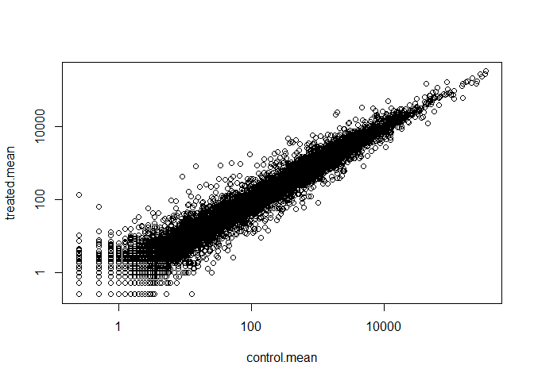

Class 15
================

\#\#Import data

The data for this hands-on session comes from a published RNA-seq
experiment where airway smooth muscle cells were treated with
dexamethasone, a synthetic glucocorticoid steroid with anti-inflammatory
effects (Himes et al. 2014).

Glucocorticoids are used, for example, by people with asthma to reduce
inflammation of the airways. The anti-inflammatory effects on airway
smooth muscle (ASM) cells has been known for some time but the
underlying molecular mechanisms are
unclear.

``` r
counts <- read.csv("data/airway_scaledcounts.csv", stringsAsFactors = FALSE)
metadata <-  read.csv("data/airway_metadata.csv", stringsAsFactors = FALSE)
```

How many genes are we dealing with?

``` r
nrow(counts)
```

    ## [1] 38694

We want to calculate the average counts per gene for control samples and
for the drug treatment samples. We will then compare these values to see
if there is a difference overall between control and treated samples for
a given gene.

``` r
#Access only row in the metadata
#metadata$id[metadata$dex=="control"]
control <- metadata[metadata$dex == "control",]
#Use the $id of the `control` data to access the control columns in `counts` and calculate the average 
control.mean <- rowSums( counts[ ,control$id] )/nrow(control) 
names(control.mean) <- counts$ensgene
```

Now do the same for the treated samples

``` r
treated <- metadata[metadata$dex == "treated",]
treated.mean <- rowSums(counts[, treated$id])/nrow(treated)
names(treated.mean) <- counts$ensgene
```

Merge control.mean and treated.mean into a dataframe

``` r
meancounts <- data.frame(control.mean, treated.mean)
```

Plot the meancounts to visualize the
data

``` r
#plot(meancounts) directly shows the data are all clustered togather in the corner
plot(meancounts, log="xy")
```

    ## Warning in xy.coords(x, y, xlabel, ylabel, log): 15032 x values <= 0
    ## omitted from logarithmic plot

    ## Warning in xy.coords(x, y, xlabel, ylabel, log): 15281 y values <= 0
    ## omitted from logarithmic plot

<!-- -->

Use the log2foldchange to modify `meancounts`
data

``` r
meancounts$log2fc <- log2(meancounts[,"treated.mean"]/meancounts[,"control.mean"])
head(meancounts)
```

    ##                 control.mean treated.mean      log2fc
    ## ENSG00000000003       900.75       658.00 -0.45303916
    ## ENSG00000000005         0.00         0.00         NaN
    ## ENSG00000000419       520.50       546.00  0.06900279
    ## ENSG00000000457       339.75       316.50 -0.10226805
    ## ENSG00000000460        97.25        78.75 -0.30441833
    ## ENSG00000000938         0.75         0.00        -Inf

remove any gene that has zero average count

``` r
zero.vals <- which(meancounts[,1:2]==0, arr.ind=TRUE)

to.rm <- unique(zero.vals[,1])
mycounts <- meancounts[-to.rm,]
head(mycounts)
```

    ##                 control.mean treated.mean      log2fc
    ## ENSG00000000003       900.75       658.00 -0.45303916
    ## ENSG00000000419       520.50       546.00  0.06900279
    ## ENSG00000000457       339.75       316.50 -0.10226805
    ## ENSG00000000460        97.25        78.75 -0.30441833
    ## ENSG00000000971      5219.00      6687.50  0.35769358
    ## ENSG00000001036      2327.00      1785.75 -0.38194109

``` r
nrow(mycounts)
```

    ## [1] 21817

A common threshold used for calling something differentially expressed
is a log2(FoldChange) of greater than 2 or less than -2. Let’s filter
the dataset both ways to see how many genes are up or down-regulated.

``` r
up.ind <- mycounts$log2fc > 2
down.ind <- mycounts$log2fc < (-2)
sum(up.ind)
```

    ## [1] 250

``` r
sum(down.ind)
```

    ## [1] 367

\#\#Do this properly with DESeq2 package

``` r
library(DESeq2)
```

    ## Loading required package: S4Vectors

    ## Warning: package 'S4Vectors' was built under R version 3.6.2

    ## Loading required package: stats4

    ## Loading required package: BiocGenerics

    ## Loading required package: parallel

    ## 
    ## Attaching package: 'BiocGenerics'

    ## The following objects are masked from 'package:parallel':
    ## 
    ##     clusterApply, clusterApplyLB, clusterCall, clusterEvalQ,
    ##     clusterExport, clusterMap, parApply, parCapply, parLapply,
    ##     parLapplyLB, parRapply, parSapply, parSapplyLB

    ## The following objects are masked from 'package:stats':
    ## 
    ##     IQR, mad, sd, var, xtabs

    ## The following objects are masked from 'package:base':
    ## 
    ##     anyDuplicated, append, as.data.frame, basename, cbind,
    ##     colnames, dirname, do.call, duplicated, eval, evalq, Filter,
    ##     Find, get, grep, grepl, intersect, is.unsorted, lapply, Map,
    ##     mapply, match, mget, order, paste, pmax, pmax.int, pmin,
    ##     pmin.int, Position, rank, rbind, Reduce, rownames, sapply,
    ##     setdiff, sort, table, tapply, union, unique, unsplit, which,
    ##     which.max, which.min

    ## 
    ## Attaching package: 'S4Vectors'

    ## The following object is masked from 'package:base':
    ## 
    ##     expand.grid

    ## Loading required package: IRanges

    ## Warning: package 'IRanges' was built under R version 3.6.2

    ## 
    ## Attaching package: 'IRanges'

    ## The following object is masked from 'package:grDevices':
    ## 
    ##     windows

    ## Loading required package: GenomicRanges

    ## Loading required package: GenomeInfoDb

    ## Loading required package: SummarizedExperiment

    ## Warning: package 'SummarizedExperiment' was built under R version 3.6.2

    ## Loading required package: Biobase

    ## Welcome to Bioconductor
    ## 
    ##     Vignettes contain introductory material; view with
    ##     'browseVignettes()'. To cite Bioconductor, see
    ##     'citation("Biobase")', and for packages 'citation("pkgname")'.

    ## Loading required package: DelayedArray

    ## Warning: package 'DelayedArray' was built under R version 3.6.2

    ## Loading required package: matrixStats

    ## Warning: package 'matrixStats' was built under R version 3.6.2

    ## 
    ## Attaching package: 'matrixStats'

    ## The following objects are masked from 'package:Biobase':
    ## 
    ##     anyMissing, rowMedians

    ## Loading required package: BiocParallel

    ## Warning: package 'BiocParallel' was built under R version 3.6.2

    ## 
    ## Attaching package: 'DelayedArray'

    ## The following objects are masked from 'package:matrixStats':
    ## 
    ##     colMaxs, colMins, colRanges, rowMaxs, rowMins, rowRanges

    ## The following objects are masked from 'package:base':
    ## 
    ##     aperm, apply, rowsum

Setup input for DESeq2 by specifying countdata, metadata, and the
experiment design(ie. which comparison we are intereted in )

``` r
dds <- DESeqDataSetFromMatrix(countData=counts, 
                              colData=metadata, 
                              design=~dex, 
                              tidy=TRUE)
```

    ## converting counts to integer mode

    ## Warning in DESeqDataSet(se, design = design, ignoreRank): some variables in
    ## design formula are characters, converting to factors

``` r
dds
```

    ## class: DESeqDataSet 
    ## dim: 38694 8 
    ## metadata(1): version
    ## assays(1): counts
    ## rownames(38694): ENSG00000000003 ENSG00000000005 ...
    ##   ENSG00000283120 ENSG00000283123
    ## rowData names(0):
    ## colnames(8): SRR1039508 SRR1039509 ... SRR1039520 SRR1039521
    ## colData names(4): id dex celltype geo_id

``` r
dds <- DESeq(dds)
```

    ## estimating size factors

    ## estimating dispersions

    ## gene-wise dispersion estimates

    ## mean-dispersion relationship

    ## final dispersion estimates

    ## fitting model and testing

``` r
res <- results(dds)
```

Volcano plots

``` r
plot(res$log2FoldChange, -log(res$padj))
```

<!-- -->

First, let’s add a column called sig to our full res results that
evaluates to TRUE only if padj\<0.05 and the absolute log2FoldChange\>2,
FALSE if not, and NA if padj is also NA.

``` r
res$sig <- res$padj<0.05 & abs(res$log2FoldChange)>2
```

A volcano plot shows the log fold change on the X-axis, and the −log10
of the p-value on the Y-axis (the more significant the p-value, the
larger the −log10 of that value will be).

Here we first make a volcano plot with base graphics and color by our
res$sig+1 (we add 1 so we dont have 0 as a color and end up with white
points):

``` r
# Set the color palette for our plot
palette( c("gray","blue") )

plot( res$log2FoldChange,  -log(res$padj), 
 col=res$sig+1, ylab="-Log(P-value)", xlab="Log2(FoldChange)")

# Add some cut-off lines
abline(v=c(-2,2), col="darkgray", lty=2)
abline(h=-log(0.1), col="darkgray", lty=2)
```

<!-- -->

``` r
# Reset the color palette
palette("default") 
```

We could also setup a custom color vector indicating transcripts with
large fold change and significant differences between conditions

``` r
# Setup our custom point color vector 
mycols <- rep("gray", nrow(res))
mycols[ abs(res$log2FoldChange) > 2 ]  <- "red" 

inds <- (res$padj < 0.01) & (abs(res$log2FoldChange) > 2 )
mycols[ inds ] <- "blue"

#Volcano plot with custom colors 
plot( res$log2FoldChange,  -log(res$padj), 
 col=mycols, ylab="-Log(P-value)", xlab="Log2(FoldChange)" )

abline(v=c(-2,2), col="gray", lty=2)
abline(h=-log(0.1), col="gray", lty=2)
```

<!-- -->
